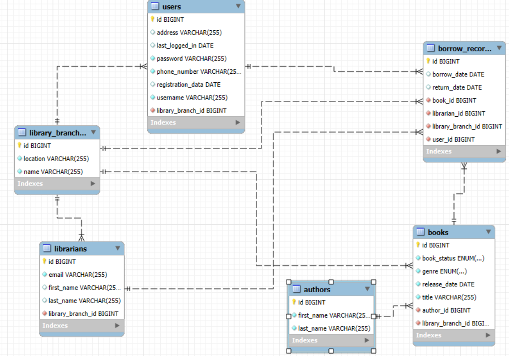

# Book_Library_System
"The system remembers books better than readers!" 📚😄

📚 Book Library System - 
Your personal  library management system!

Welcome to Book Library — a powerful and structured Library Management System developed with Java and Spring Boot. This application allows you to manage books, authors, users, librarians, borrow records, and library branches. Whether you're building a real library app or practicing enterprise-level architecture — this is the project for you!
----------------------------------------------------------------------------------------
----------------------------------------------------------------------------------------

📝 Project Description 

Book Library System is a library data management application developed with Java and Spring Boot, simulating the functionality of a real-life library. The system allows adding, editing, and deleting books, authors, users, library branches, and staff members.

As the administrator, you have full control over the database and can perform all essential operations related to library management. The application is designed with a strong focus on clean architecture and follows best programming practices.

----------------------------------------------------------------------------------------

📚 Main Modules & Features

🗃️ Books & Authors

Add new books linked to their respective authors.

View and remove books from the system.

Manage author records — create and delete entries.

🧑‍💼 Users & Librarians

Register new users with strict username and password validation.

Update user contact information.

Manage librarians and assign them to specific branches.

🏢 Library Branches

Create and manage new library branches for better organization.

Distribute books and staff across branches.

📑 Borrow Records

Record when a user borrows a book.

Track which user has borrowed which book.

⚠️ Validation & Error Handling

Rigorous input validation using DTO classes.

Custom exceptions with unified error messages.

----------------------------------------------------------------------------------------

🛠️ Technologies Used

Java (OOP principles, SOLID, Design Patterns)

Spring Boot (Core Framework)

Spring Data JPA (Database access)

Spring Web (REST API) — for the future web version

Spring Validation — for DTO checks

Hibernate ORM

MySQL — relational database

ModelMapper — entity mapping

Apache Maven — project build & dependencies

JUnit 4 — Unit Testing

Mockito — mocking repositories/services in tests

----------------------------------------------------------------------------------------

🚀 Project Status

✅ Console Application —  Finished

✅ Unit Tests — Finished with service & logic layer tests (mocked where needed)

🚧 REST API (Web Application) — In progress (future feature)

✅ Documentation & Code Comments — Done

----------------------------------------------------------------------------------------

🧩 Project Structure

----------------------------------------------------------------------------------------

👨‍💻 Author

[Vesela Petkova]

📩 [Email] | vpetkova0204@abv.bg